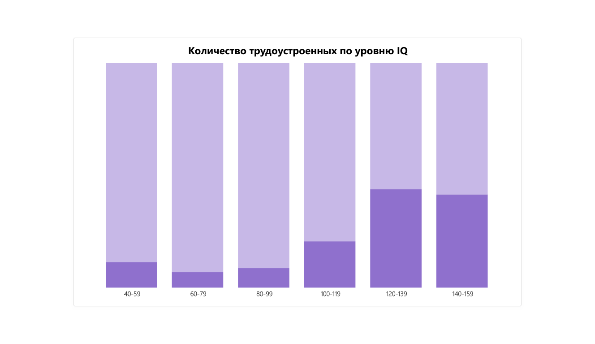
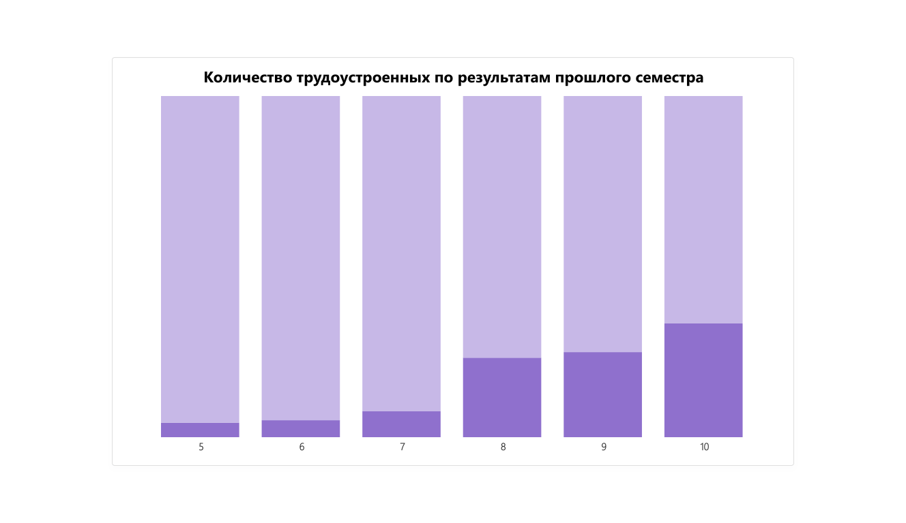
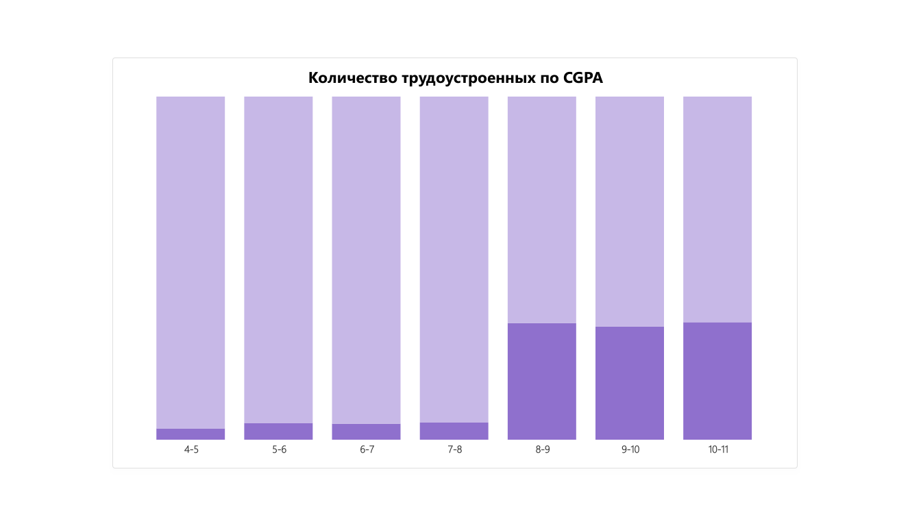
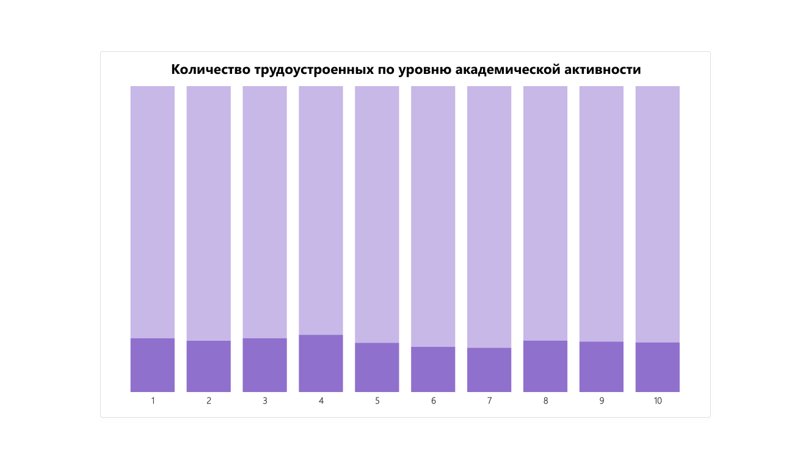
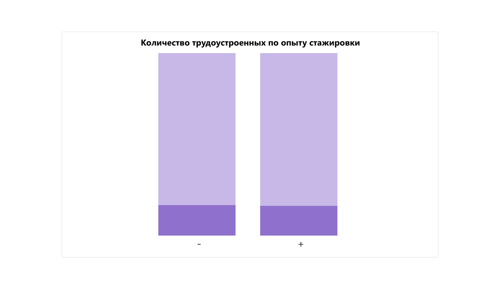
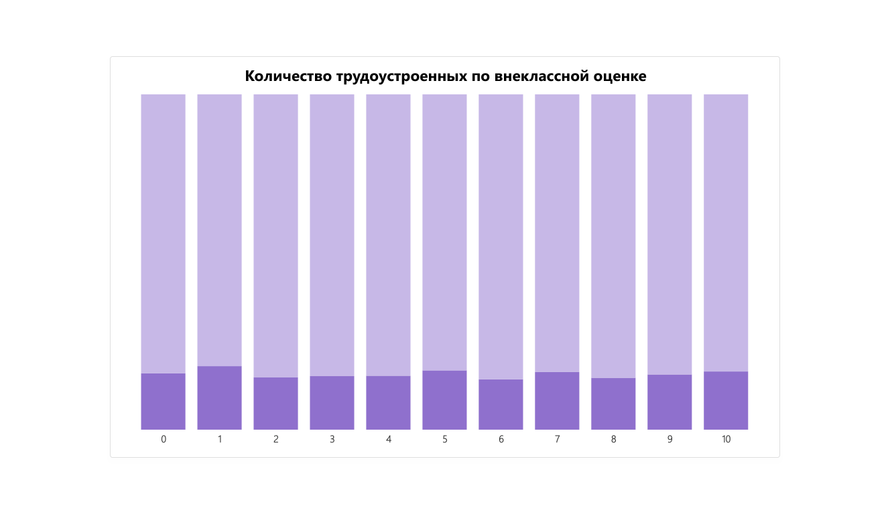

# 
college-placement-analysis

Анализ трудоустройства студентов по их характеристикам с использованием SQL и Power BI.

Основная задача - определить, какие характеристики больше всего влияют на трудоустроенность студентов.

Исследуемая таблица включает в себя:

- **id** - уникальный идентификатор студента;  
- **college_id** - идентификатор колледжа, в котором студент обучается;  
- **iq** - уровень IQ студента;  
- **prev_sem_result** - оценка студента за прошлый семестр;  
- **CGPA** - GPA студента за весь период обучения;  
- **academic_performance** - академическая успеваемость;  
- **internship_experience** - опыт стажировки;  
- **extra_curriculat_score** - внеклассная оценка;  
- **communication_skills** - навыки коммуникации;  
- **projects_completed** - количество выполненных проектов;  
- **placement** - трудоустроенность.

## 
 Визуализации 

!(диаграмма по навыкам коммуникации)(visuals/college_placement_visualization-7.png)
!(диаграмма по количеству проектов)[visuals/college_placement_visualization-8.png]
